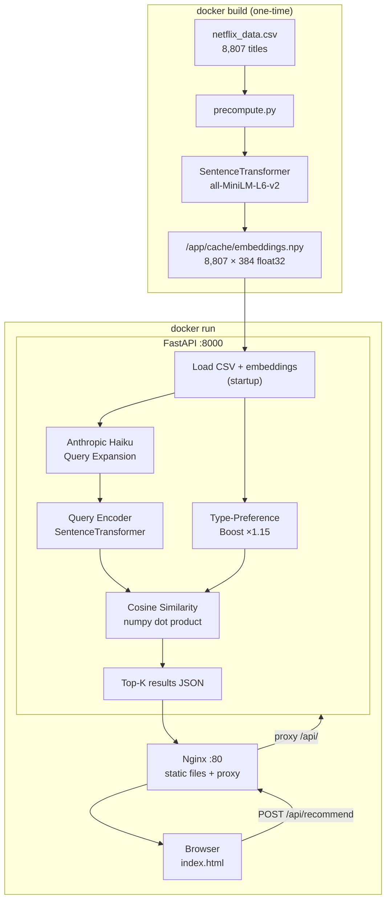
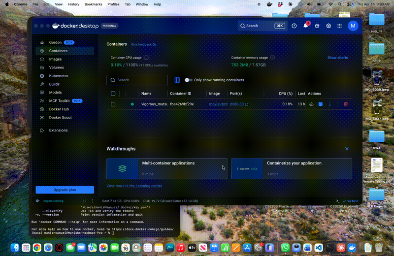

# TeloHive Flix — Movie Recommender

A content-based recommender that accepts natural-language queries and returns
ranked titles from the Netflix catalogue (8,807 items).

---

## Quick Start

### Prerequisites

- [Docker Desktop](https://www.docker.com/products/docker-desktop/) installed and **running**
  - Mac: open Docker Desktop from Applications and wait for the menu-bar whale icon to stop animating
  - Windows: open Docker Desktop from the Start menu and wait for it to show "Engine running"

### 1 — Clone the repo

```bash
git clone https://github.com/ManishKanuri/telohive-flix.git
cd telohive-flix
```

### 2 — Build the image

```bash
docker build -t telohive-flix .
```

> This takes 3–5 minutes the first time — it installs dependencies, downloads the
> embedding model, and pre-computes embeddings for all 8,807 titles.

### 3 — Run the container

**With an Anthropic API key** (enables AI-powered query expansion):

```bash
docker run -p 8080:80 -e ANTHROPIC_API_KEY=sk-ant-... telohive-flix
```

**Without an API key** (embedding-only search, still works well):

```bash
docker run -p 8080:80 telohive-flix
```

### 4 — Open the app

Go to **http://localhost:8080** in your browser.

To stop the container press `Ctrl+C` in the terminal.

---

## Architecture



---

## AI Setup

| Layer | Provider | Model |
|---|---|---|
| Query understanding / expansion | **Anthropic** | `claude-haiku-4-5-20251001` |
| Item + query embedding | HuggingFace (local) | `all-MiniLM-L6-v2` |

**Before running, set your Anthropic API key:**

```bash
docker run -p 8080:80 -e ANTHROPIC_API_KEY=sk-ant-... movie-recommender
```

The LLM call uses ~100–150 tokens per query and adds ~200 ms latency.
If the key is absent or the call fails, the raw user query is embedded directly.

---

## Approach

### 1 — Item Representation

Each CSV row is converted to a natural-language sentence before embedding:

```
Dark Crimes is a Movie in the genres of Dramas, Thrillers, released in 2016
rated R. A detective on a cold murder case discovers that a famous writer's
novel contains details chillingly similar to the crime. Directed by
Alexandros Avranas. Starring Jim Carrey, Charlotte Gainsbourg. from United States.
```

Writing items as sentences (rather than pipe-separated tokens) gives the
embedding model richer semantic context and improves retrieval for
conversational queries.

### 2 — Offline Embedding Index

During `docker build`, `precompute.py` encodes all 8,807 documents in batches
of 128 with `all-MiniLM-L6-v2` (384-dim, unit-normalised) and saves the
result as `/app/cache/embeddings.npy` (~13 MB) baked into the image.
The container loads this file at startup — no re-encoding at runtime.

### 3 — Query Understanding

Before encoding, the user's query is sent to `claude-haiku-4-5-20251001` with
a structured prompt that extracts genres, mood/tone, narrative devices,
era/setting, origin signals, and content-type preference. The expansion is
appended to the original query (not replacing it) so specific wording is
preserved while semantic coverage increases.

### 4 — Type-Preference Boosting

If the query contains movie/film signals, Movie scores receive a ×1.15
multiplier. Show/series/episode signals apply the same boost to TV Shows.
This lightweight heuristic improves precision without requiring a separate
filter step.

### 5 — Retrieval

The expanded query is encoded with the same model and normalised. A dot
product between the (1 × 384) query vector and the (N × 384) embedding
matrix yields cosine-similarity scores for all items in a single operation
(~0.5 ms on CPU). The top-K indices are sorted and enriched with metadata
from the DataFrame before being returned as JSON.

---

## Demo

Query: **"slow-burn psychological thriller with an unreliable narrator"**



---

## Project Structure

```
movie-recommender/
├── backend/
│   ├── main.py
│   ├── recommender.py
│   ├── precompute.py
│   ├── utils.py
│   └── requirements.txt
├── static/
│   └── index.html
├── nginx.conf
├── supervisord.conf
├── Dockerfile
└── README.md
```
